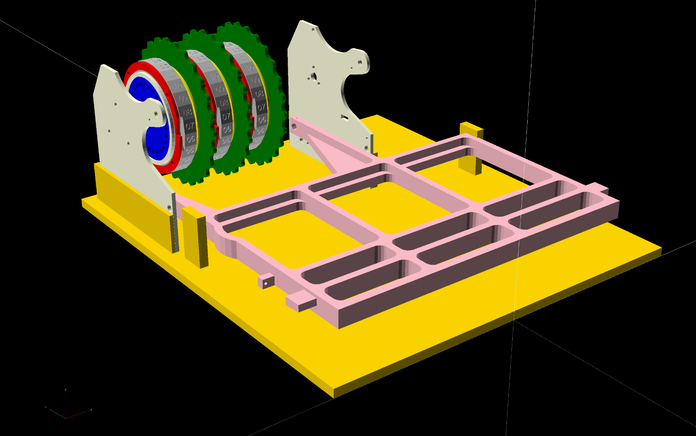
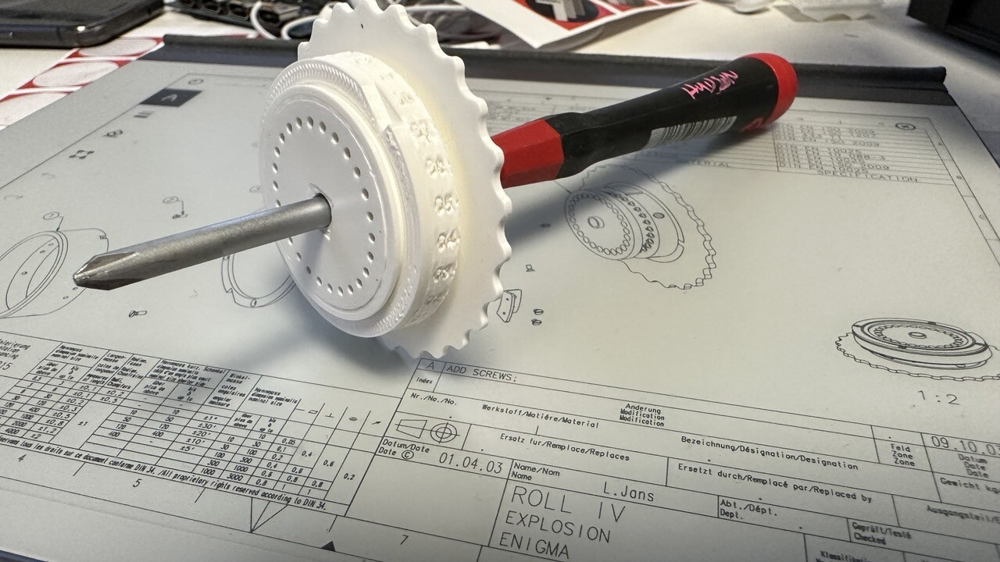

# 3D printable enigma machine

Based on the blue prints from [Enigma Nachbauprojekt](http://www.enigma.hs-weingarten.de/drawings.php)

The full size machine won't fit on a Mini printer and there are several parts
that are not easily FDM printable.  The `printable.scad` has modifications from
the original design to make it easier to print.

**NOTE** This is a work in progress! Some of the parts have been test printed,
but not all of the designs are ready yet.

Hardware:

* M3 counter sink screws
* M5 axle for rotor
* Need to find pogopins and pogopads

Ideas:

* Use a PCB for the rotor plate? This would allow the wiring to be done in the circuit.
* Laser cut some parts?

